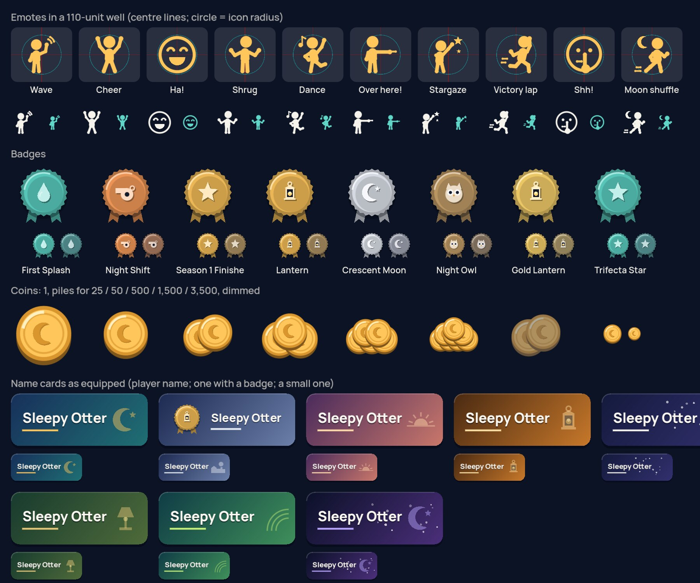

# V7 menus evidence: Locker, Emotes, Season Pass, Shop

The menus workstream of V7 (brief §4 shared layout budget, §5 Locker and
Emotes, §6 Season Pass, the Shop part of §7). Matched **before / after**
runtime screenshots of the same screens, states and device shapes, the
final allocated rects measured in each run, and the reward art sheet.

## How these were made

- **Renderer:** the real game, rendered by Godot 4.7.2's Mobile renderer on
  Mesa **llvmpipe** (software Vulkan) under Xvfb on a shared desktop Linux
  machine. Layout, states and art only: **not** frame rate, touch feel or a
  device. No iPhone or iPad was available.
- **Tooling:** `tools/capture_v7_menus.sh OUT_DIR [devices]` runs
  `game/src/dev/menus_capture.tscn` once per device. Each run also writes
  `measure.json`, with the final allocated rects measured from the running
  layout, never `custom_minimum_size`. Compact copies are in `measure/`.
- **Before:** source at `d2d0749`, the V6 integration this branch starts
  from, run from a frozen copy with the same capture scene.
- **After:** this branch.
- **Images:** scaled to 1280 px wide (JPEG q82). `art_sheet.jpg` is full
  size.
- **Owner screenshots:** IMG_3016-3020 were not available to this
  workstream. The defects were reproduced from the brief's table at the
  same screens and states.

### Devices (landscape)

| Folder | Pixels | Points | Point scale | Safe area, points (L, T, R, B) | Canvas units |
|---|---|---|---|---|---|
| `se` | 1334×750 | 667×375 | @2x | 0, 0, 0, 0 | 1280×720 |
| `x` | 2436×1125 | 812×375 | @3x | 44, 0, 44, 21 | 1559×720 |
| `p14` | 2532×1170 | 844×390 | @3x | 47, 0, 47, 21 | 1558×720 |
| `pmax` | 2778×1284 | 926×428 | @3x | 47, 0, 47, 21 | 1557×720 |
| `ipad` | 2048×1536 | 1024×768 | @2x | 0, 24, 0, 20 | 1280×960 |
| `s2048` | 2048×946 | owner screenshot aspect, emulated as 844×390 pt | 2.426 | 47, 0, 47, 21 | 1558×720 |
| `s1536` | 1536×710 | owner screenshot aspect, emulated as 844×390 pt | 1.821 | 47, 0, 47, 21 | 1557×720 |

The 2048×946 and 1536×710 image sizes alone do not identify a device. They
are run as resized 844×390 pt screenshots: the same aspect ratio, and the
same 1558×720 canvas as a notched phone.

### States and adapters

- **`svcon_test`:** the service-on states. They use the **TEST ADAPTERS**:
  the test-double service (`game/src/dev/fake_commerce_service.gd`) and the
  simulated App Store (`game/src/dev/test_store_adapter.gd`; its prices read
  "(test price)").
  - Wallet: 1,995 Coins.
  - Season 1: tier 15 of 30. Tiers 1, 3, 5 and 9 Free claimed.
  - Owned on the account: the After Hours name card, the Pom-Pom Beanie,
    Stargaze and the After Hours Hoodie.
  - `16_…premium_owned_claimable` adds Premium late, so earned Premium
    rewards become claimable.
- **`svcoff`:** the shipped configuration: no game service, the real
  (unavailable off-device) store adapter, a blank wallet. Nothing is faked.
  The 345 Coins shown are the pre-V6 balance kept on the device.
- **The player:** a V5 tester's save. Default look (pajamas, nightcap,
  bunny slippers), plus Fluffy Robe, Frog Onesie, Paper Crown, Plum and
  Wiggle Dance.

## Shots

`p14` has every shot. The other devices have the key shots (01, 02, 03,
10, 11, 13, 15, 20, 24, 30, 33).

| File | Shows |
|---|---|
| `01_svcon_test_locker_outfit` | Locker, Outfit (IMG_3018) |
| `02_svcon_test_locker_emotes` | Locker, Emotes (IMG_3016) |
| `03_svcon_test_locker_emote_selected` | Stargaze picked: plays on the runner; Save look / Undo appear |
| `04`–`07` | Locker Hat, Shoes, Face, Profile |
| `10`/`11` | Season Pass, first tier: Free / Premium selected |
| `12`/`13` | Middle tier (15): Free / Premium selected |
| `14`/`15` | Last tier (30): Free / Premium selected |
| `16_svcon_test_pass_premium_owned_claimable` | Premium bought late: earned Premium rewards claimable; an emote previewed on the small live runner |
| `20`–`23` | Shop: Featured, Outfits, Accessories, Coins (test prices) |
| `24`/`25` | Shop detail: outfit, hat |
| `26` | Coin purchase confirmation (unchanged behaviour) |
| `30`–`35` | Season Pass, service off: first / middle / last tier, Free / Premium |
| `40`–`43` | Shop service off: Featured, an owned item's detail, an unowned item's detail; Locker Emotes |

## Issue register (these screens)

All rects below are canvas units. A phone in landscape is 720 units tall,
about 1.85 units per point.

The full register (cause, fix and test per item) is in
[../../../v7/menus_notes.md](../../../v7/menus_notes.md).

| Owner report | Before (`before/p14/…`) | After (`after/p14/…`) |
|---|---|---|
| IMG_3016, Emotes: glyphs past their wells, oversized cards, giant disabled "Wearing this", long footer | `02`: each glyph centred (+88, +88) units off its well, past the card edge (all 7); cards 199×291 in a 320-unit list; a 320×90 disabled button and a caption below the panel | `02`/`03`: glyph centred exactly in its well (0.0, 0.0); cards 149×163, all emotes in view; a small Equipped line; Save look / Undo only after a pick (`03`), inside the panel; picking plays the move on the runner |
| IMG_3018, Outfit: tall cards, "more in the Shop" card, footer action outside the panel, nightcap and slippers in every thumbnail | `01` | `01`: 5 columns from the panel's final width; outfits pictured with no hat and plain shoes (the runner keeps the real look); a one-line "N more in the Shop ›" link at the end of the list; footer inside the panel |
| IMG_3017, Season Pass: Premium row and Claim below the screen, big header and paragraph, empty name-card strips | `30`/`33` (service off): Premium row y 606-750 on a 720-unit screen, Claim 65% visible, "Ready to claim" over a disabled button; `13`: the name card an empty strip | `10`-`15` and `30`-`35`: both rows whole at every size (table below), the action fixed in the detail, a one-row header; service off: "Rewards unavailable right now" in the header, "Earned at Tier 1, not claimed yet" with the reason above a visibly disabled Claim; name cards with the player's name, close hat framing, full-body outfits, medallion badges, Coin piles; an emote previewed on a small live runner (`16`) |
| Shop (same card and art problems) | `20`-`26`, `40`-`42` | the same card system, one short unavailable line, status right above the action; purchase flow unchanged (`26`) |

Season Pass after the fix, service on, measured by
`test_menus_layout::test_pass_rows_and_detail_action_fit_every_device`
(canvas units):

| Device | Free row y | Premium row y | Cell | Safe bottom | Detail action y |
|---|---|---|---|---|---|
| se | 281-481 | 489-689 | 160×200 | 708 | 603-688 |
| x | 281-467 | 475-661 | 148×186 | 680 | 575-660 |
| p14, s2048, s1536 | 275-465 | 473-663 | 152×190 | 681 | 580-662 |
| pmax | 261-459 | 467-665 | 158×198 | 685 | 590-665 |
| ipad | 265-505 | 513-753 | 192×240 | 935 | 860-915 |

Before, from `measure/*_before.json`:

- **x (812×375), service on:** the Premium row ended at y 685, below the
  safe bottom (680).
- **se, x and p14, service off:** the Premium row ended at y 750-753, below
  the 720-unit screen.

Locker after the fix, measured by
`test_menus_layout::test_locker_bounds_at_every_device`:

| Device | Item panel | Columns | Outfit card | Emote card | Glyph offset from well centre |
|---|---|---|---|---|---|
| se, ipad | 734 wide | 4 | 168×262 | 168×175 | 0, 0 |
| x, p14, pmax, s2048, s1536 | 818-827 wide | 5 | 149-151 × 242-244 | 149-151 × 163-164 | 0, 0 |

Outfit cards here reserve two name lines, because every item is granted
and long names like "After Hours Hoodie" are present. With short names
they are one line shorter.

## Reward art

The sheet (`game/src/dev/menus_art_sheet.tscn`) shows:

- **Emotes:** every emote icon in a card well. The red lines mark the well's
  centre and the cyan circle the icon's radius.
- **Badges:** at two sizes, plus dimmed (locked).
- **Coins:** a single Coin, the piles used for 25 / 50 / 500 / 1,500 /
  3,500, and a dimmed pile.
- **Name cards:** every name card drawn as it appears when equipped, large
  and small, one of them with a badge.

All of it is vector art, drawn the same way in the Locker, Shop and Pass.

## Limits

- **No device.** Touch feel, the real safe areas and on-device rendering are
  unverified. Real iOS touch is not the emulated mouse used by the tests and
  captures.
- **No live service or App Store products.** The service-on states use the
  test adapters, labelled as such. The shipped build is the `svcoff` state.
- **Shared, overloaded CPU.** The captures were rendered on a CPU shared by
  three other sessions. They show layout, not speed.
